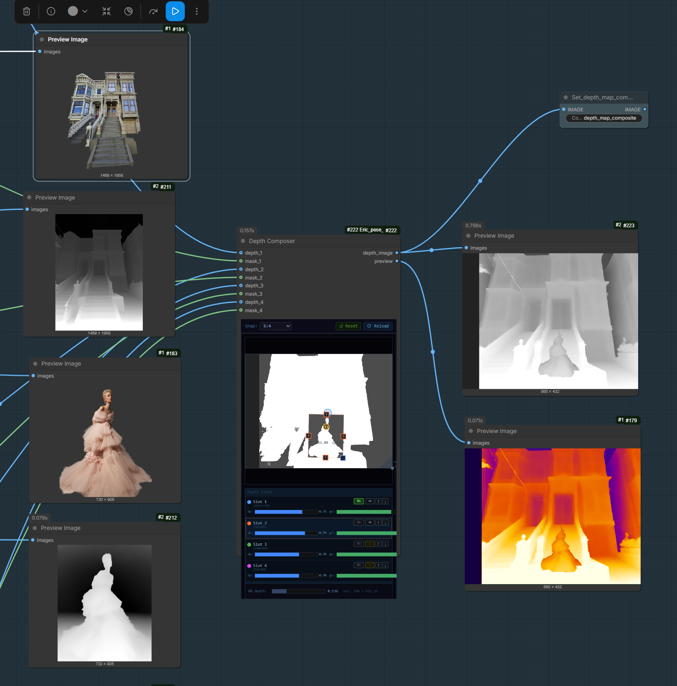
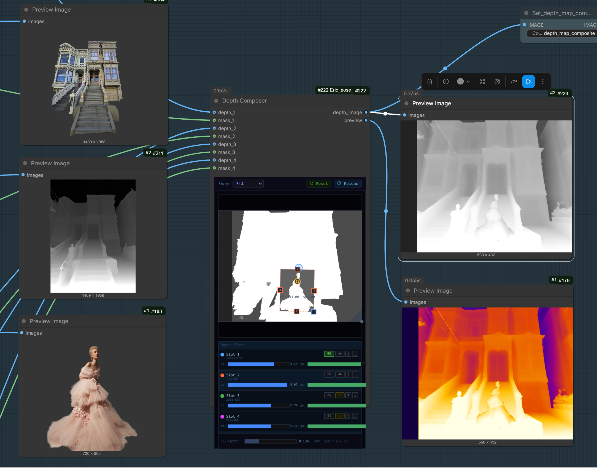
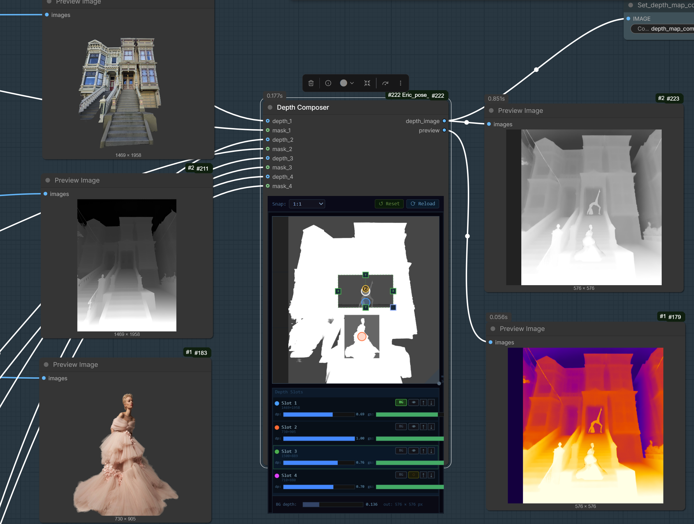
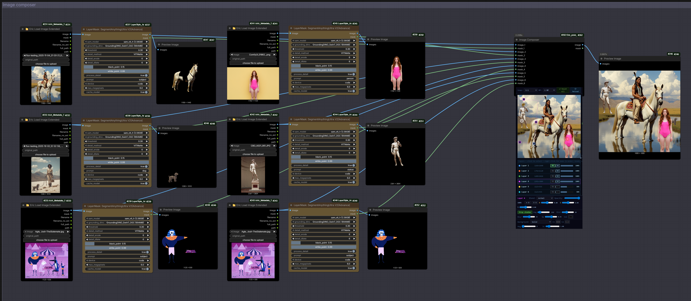
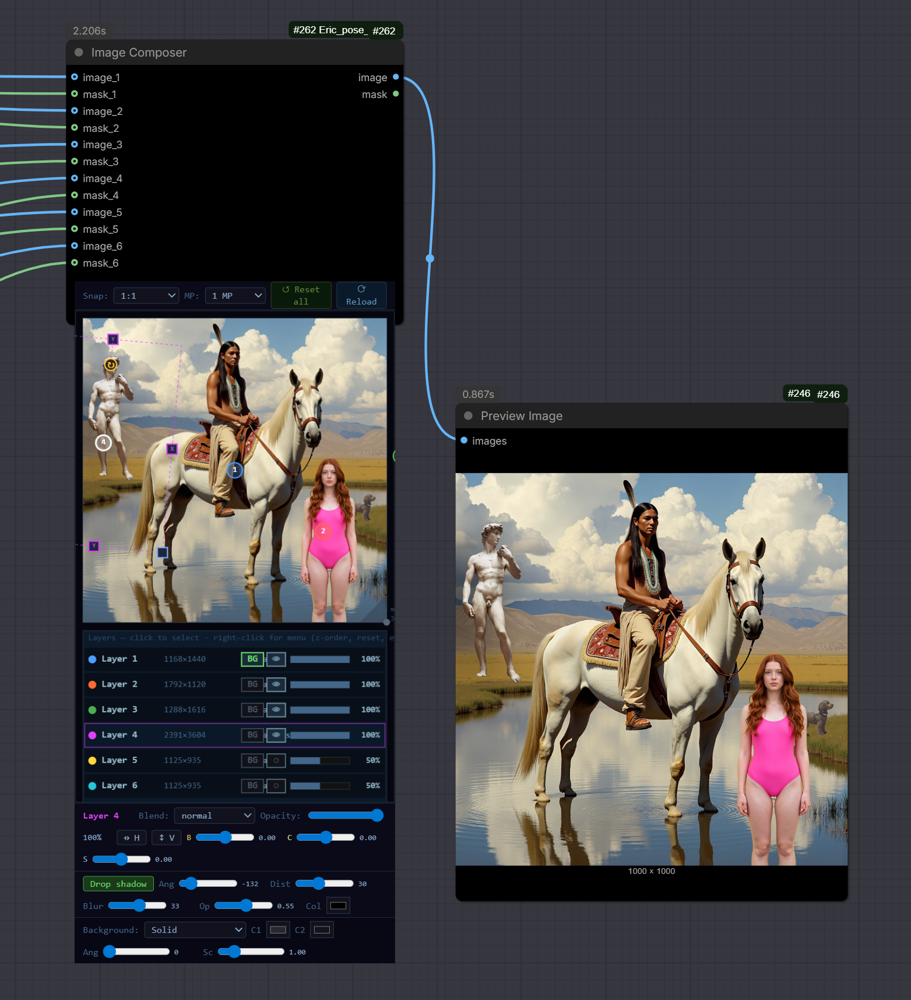
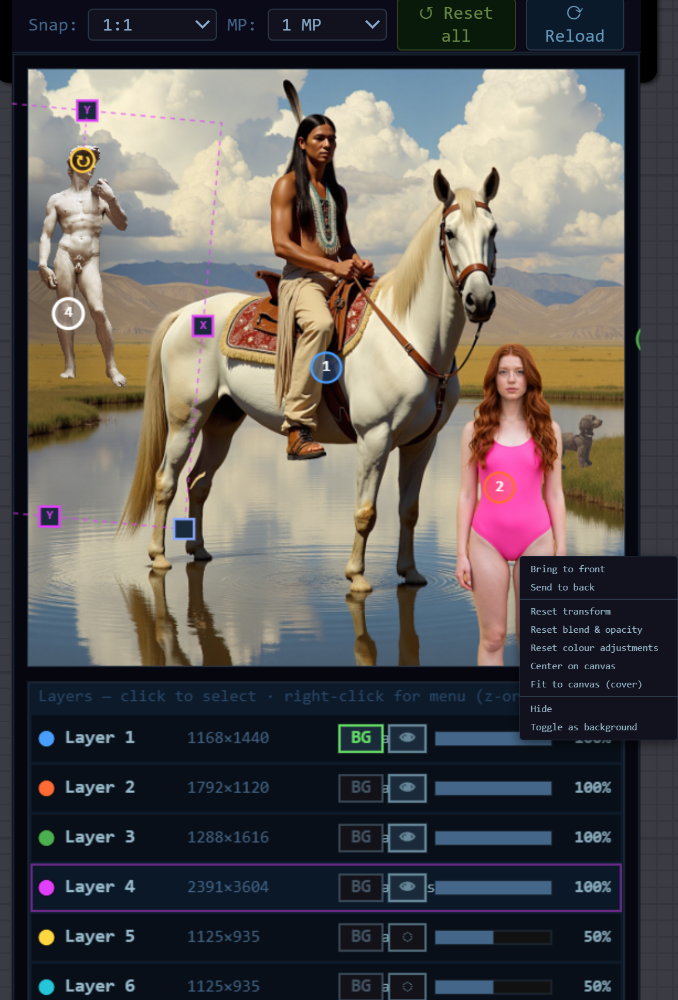

# Eric_Composer_Studio

A ComfyUI custom node package for high-quality pose detection plus interactive multi-layer image, depth, pose, and text compositing. Pose extraction uses RTMW and DWPose via the `rtmlib` ONNX backend; the composer nodes provide canvas-based layer arrangement, blend modes, drop shadows, and per-layer transforms — all in single ComfyUI nodes.

> Formerly published as `Eric_pose_studio`. Renamed to reflect the broader scope (image / depth / text compositing in addition to pose). Saved pose JSON files from the previous name still load.

---

## Overview

Eric_Composer_Studio is built around two themes:

**Better pose extraction**
1. **Poor pose extraction in existing tools** — missing hands, arms, and feet due to low confidence thresholds and weaker models. RTMW-x significantly outperforms DWPose, especially for arms, hands, and feet.
2. **No composition control** — no way to place detected skeletons where you want them in a target canvas before feeding to ControlNet.

All pose nodes use the standard `POSE_KEYPOINT` data type from `comfyui_controlnet_aux`, so they are fully interoperable with huchenlei's nodes and any other node that uses that type.

**Visual compositing inside ComfyUI**
- **Image Composer** — 6-layer image compositor with per-layer transform, blend modes, drop shadow, brightness/contrast/saturation, and procedural or image backgrounds.
- **Depth Composer** — 4-slot interactive depth map compositor with per-slot placement and gradient control.
- **Text Layer** — text-to-(image, mask) renderer that pairs directly with Image Composer slots.
- **Pose Composer** — interactive multi-person pose composition on a single canvas.

---

## Requirements

- ComfyUI (any recent version)
- `rtmlib` — install via:
  ```
  python_embeded\python.exe -m pip install rtmlib
  ```
- `onnxruntime-gpu` (recommended) or `onnxruntime` (CPU fallback)
- `opencv-python`, `numpy`, `Pillow`, `torch` — usually already present in ComfyUI; `Pillow` is listed in `requirements.txt` for completeness (used by Text Layer).

**Note on onnxruntime:** If you have both `onnxruntime` and `onnxruntime-gpu` installed simultaneously, GPU inference will still be selected automatically. The node logs which provider is active on first run.

---

## Installation

### Option A — ComfyUI Manager (recommended once published)

1. Open **Manager → Custom Nodes Manager** in ComfyUI.
2. Search for `Eric Composer Studio`.
3. Click **Install**.
4. Restart ComfyUI when prompted.

Manager will install Python dependencies from `requirements.txt` automatically.

### Option B — Manual install (git)

From your ComfyUI install root:

```bat
cd ComfyUI\custom_nodes
git clone https://github.com/EricRollei/Eric_Composer_Studio.git
cd Eric_Composer_Studio
..\..\python_embeded\python.exe -m pip install -r requirements.txt
```

(For non-portable installs, replace `..\..\python_embeded\python.exe` with your ComfyUI Python interpreter, e.g. `python` inside the conda/venv environment that runs ComfyUI.)

Then restart ComfyUI. All nodes appear under the **Eric_Composer_Studio** category in the node menu.

### Updating

```bat
cd ComfyUI\custom_nodes\Eric_Composer_Studio
git pull
```

If a new release adds dependencies, re-run the `pip install -r requirements.txt` line above.

---

## Nodes

### Pose Detector (RTMW/DWPose)

Runs pose detection on an input image using RTMW or DWPose via ONNX.

**Inputs:**

| Parameter | Type | Default | Description |
|---|---|---|---|
| image | IMAGE | - | Input image batch |
| model | dropdown | rtmw-x | Detection model: `rtmw-x`, `rtmw-l`, `rtmw-m`, `dwpose` |
| device | dropdown | cuda | `cuda` or `cpu` |
| score_threshold | FLOAT | 0.30 | Keypoint confidence cutoff. **Lower to 0.15-0.20 to recover occluded arms/hands.** |
| det_score_thresh | FLOAT | 0.50 | Person detector confidence. Only lower if entire people are being missed. |
| preview_color_mode | dropdown | enhanced | `dwpose` (standard colors) or `enhanced` (L/R color-coded) |
| preview_line_width | INT | 4 | Line thickness for preview skeleton |
| preview_joint_radius | INT | 5 | Joint dot radius for preview skeleton |
| draw_face | BOOLEAN | true | Include face keypoints in preview |
| draw_hands | BOOLEAN | true | Include hand keypoints in preview |
| draw_feet | BOOLEAN | true | Include foot keypoints in preview |

**Outputs:**

| Output | Type | Description |
|---|---|---|
| pose_keypoint | POSE_KEYPOINT | Detected keypoints in OpenPose JSON format |
| skeleton_preview | IMAGE | Rendered skeleton image at source resolution |

**Model comparison:**

| Model | Keypoints | mAP (COCO-WB) | Speed | Best for |
|---|---|---|---|---|
| rtmw-x | 133 (body+hands+face+feet) | 70.2 | Moderate | Best quality, default choice |
| rtmw-l | 133 | ~68 | Faster | Good quality/speed balance |
| rtmw-m | 133 | ~65 | Fast | Quick iteration |
| dwpose | 133 | 66.5 | Fast | Maximum ControlNet compatibility |

**Tuning guide for arm/hand detection:**

RTMW predicts arm and hand keypoints at lower confidence scores than body joints, especially when limbs are partially occluded, blurred, or foreshortened. The default `score_threshold` of 0.30 often drops these predictions. Try:
- `score_threshold = 0.15` for difficult images with obscured arms
- `score_threshold = 0.20` for a good balance
- `det_score_thresh` only matters if whole people vanish - leave at 0.50 normally

Models auto-download on first use to rtmlib's cache (`~/.cache/rtmlib/`). If you have models in `ComfyUI/models/pose/`, the node uses those instead.

---

### Pose Renderer

Renders a `POSE_KEYPOINT` to a skeleton image for ControlNet conditioning.

**Inputs:**

| Parameter | Type | Default | Description |
|---|---|---|---|
| pose_keypoint | POSE_KEYPOINT | - | Keypoint data to render |
| keep_input_size | BOOLEAN | true | Use canvas size stored in POSE_KEYPOINT (recommended). When false, renders at canvas_width × canvas_height. |
| canvas_width | INT | 1024 | Output width (only used when keep_input_size = false) |
| canvas_height | INT | 1024 | Output height (only used when keep_input_size = false) |
| color_mode | dropdown | dwpose | `dwpose` (ControlNet-safe colors) or `enhanced` (L/R color-coded) |
| line_width | INT | 4 | **Enhanced mode only.** Body limb thickness. DWPose mode always uses stickwidth=4. |
| joint_radius | INT | 4 | **Enhanced mode only.** Body joint dot radius. DWPose mode always uses radius=4. |
| face_dot_radius | INT | 2 | Face keypoint dot size. Default 2 suits most uses. Reduce to 1 for very small skeletons in multi-person compositions where dots would merge. |
| draw_face | BOOLEAN | true | Render face keypoints |
| draw_hands | BOOLEAN | true | Render hand keypoints |
| draw_feet | BOOLEAN | true | Render foot keypoints |
| body_only | BOOLEAN | false | Disable face, hands and feet in one click. Overrides the three individual toggles above. |
| xinsr_stick_scaling | BOOLEAN | false | Scale stick and joint sizes for `xinsir/controlnet-openpose-sdxl-1.0`. See Xinsir scaling note below. |

**Outputs:** `skeleton_image` (IMAGE)

**Key notes:**

- `keep_input_size = true` is the correct setting for ControlNet use. It renders the skeleton at the exact resolution stored in the POSE_KEYPOINT data, avoiding any rescaling that would misalign the skeleton with your generation.
- `color_mode = dwpose` matches the exact OpenPose training data format that all standard ControlNet models were trained on. Use this for ControlNet input.
- `color_mode = enhanced` uses distinct warm (right side) / cool (left side) colors for visual analysis. Do not use this for ControlNet conditioning.
- `body_only` is useful when hands and face are not needed for your shot type, or when rendering a high-density multi-person composition where fine detail would merge.
- **Face dot radius guidance for multi-person:** When composing several people scaled to fit a canvas the face dots (70 keypoints) and hand joint lines can merge into noise. Reduce `face_dot_radius` to 1 or disable face entirely for tight compositions. The ControlNet still reads the body skeleton accurately.
- **Xinsir scaling note:** `xinsr_stick_scaling` matches the `draw_bodypose` training function published by [xinsir/controlnet-openpose-sdxl-1.0](https://huggingface.co/xinsir/controlnet-openpose-sdxl-1.0). It scales both stick width and joint radius together by a factor of 1–7 depending on canvas size (factor 3 at 1024px → stickwidth=12, joint radius=12). Use this only for xinsir's SDXL models. Use standard DWPose mode for all other ControlNet targets including Flux Union and SD3.

---

### Pose Canvas Crop/Fit

Changes the visible canvas region without distorting the skeleton. Analogous to cropping or padding a photo - the person's proportions are unchanged, only the framing changes.

**Modes:**

| Mode | Description |
|---|---|
| `fit_to_ratio` | Letterbox or pillarbox to match target aspect. **Start here.** |
| `crop_to_ratio` | Centre-crop to target aspect. Trims edges. |
| `crop` | Manual crop rectangle (crop_x, crop_y, crop_w, crop_h) |
| `pad` | Add explicit padding margins (pad_left, pad_top, pad_right, pad_bottom) |

**Inputs:** `pose_keypoint`, `mode`, `output_width`, `output_height`, plus mode-specific parameters.

**Output:** `pose_keypoint` (rescaled to new canvas dimensions)

**Important:** This node performs coordinate transformations only - no re-running inference. Use it to reframe a pose from a source photo to match your generation canvas before rendering.

---

### Pose Transform (uniform)

Moves and uniformly scales a skeleton within a target canvas. No separate X/Y scaling - that would distort the pose geometry.

**Inputs:**

| Parameter | Type | Default | Description |
|---|---|---|---|
| pose_keypoint | POSE_KEYPOINT | - | Input pose |
| target_width | INT | 1024 | Output canvas width |
| target_height | INT | 1024 | Output canvas height |
| scale | FLOAT | 1.0 | Uniform scale (pivot = skeleton centroid) |
| translate_x | INT | 0 | Horizontal offset in target canvas pixels |
| translate_y | INT | 0 | Vertical offset in target canvas pixels |
| rotate_degrees | FLOAT | 0.0 | Rotation in degrees. Note: this changes actual pose geometry. |

**Output:** `pose_keypoint`

**Note on rotation:** Rotating a skeleton changes the actual pose data - a tilted torso looks different to ControlNet than an upright one. Use rotation sparingly and only when the original pose is genuinely tilted.

---

### Pose Composer

Interactive single-node composition tool. Detect poses from up to 3 photos and/or connect up to 3 pre-detected `POSE_KEYPOINT` inputs, then arrange up to 6 individual persons on a configurable canvas using drag and scale handles.

#### Inputs

| Parameter | Type | Description |
|---|---|---|
| photo_1/2/3 | IMAGE | Optional source photos - RTMW-x runs internally |
| pose_1/2/3 | POSE_KEYPOINT | Optional pre-detected poses from PoseDetector nodes |
| score_threshold | FLOAT (0.3) | Keypoint confidence for photo inputs. Lower to 0.15 for occluded arms/hands. |
| det_score_thresh | FLOAT (0.5) | Person detector confidence for photo inputs. |

**State widgets** (`content_hash`, `detected_poses_json`, `composition_data`) are hidden automatically - they store the session state and persist between ComfyUI restarts.

#### Outputs

| Output | Type | Description |
|---|---|---|
| pose_keypoint | POSE_KEYPOINT | Merged pose data of all visible persons at output canvas size |
| skeleton_image | IMAGE | Rendered skeleton at output canvas resolution |

#### Canvas UI

The Pose Composer has a fully interactive canvas inside the node:

```
┌─────────────────────────────────────────┐
│  Snap: [ratio dropdown]    [DWPose btn] │  ← ratio bar
├─────────────────────────────────────────┤
│                                         │
│   ┌──────────────────────────────┐      │
│   │   composition canvas         │      │
│   │   (drag corner to resize)    │      │
│   │                              │      │
│   │   ○ skeleton 1               │  ◥   │ ← resize handle
│   └──────────────────────────────┘      │
│                                         │
│   ■ Photo 1 - Person 1    ×1.00  👁     │  ← person list
│   ■ Photo 2 - Person 1    ×0.68  👁     │
└─────────────────────────────────────────┘
```

#### Workflow

1. **Connect inputs** - Connect photos to `photo_1/2/3` and/or pre-detected poses to `pose_1/2/3`
2. **Queue once** - Detection runs and skeletons appear on the canvas at their proportional positions
3. **Arrange** - Drag and scale skeletons as needed (no re-queue required)
4. **Queue for output** - Python applies your transforms and outputs the final `POSE_KEYPOINT` and `skeleton_image`

#### Canvas interaction

| Action | How |
|---|---|
| **Move a skeleton** | Click and drag the white circle (centroid handle) on the torso |
| **Scale a skeleton** | Click skeleton to select (it brightens), then drag the small square handle at top-right of its bounding box |
| **Select from list** | Click the person row in the list panel at the bottom |
| **Toggle visibility** | Click the eye icon on the right of any person row |
| **Resize canvas** | Drag the triangle corner handle at the bottom-right of the composition area |
| **Snap to ratio** | Choose from the `Snap:` dropdown (3:1 → 1:3) - snaps height immediately |
| **Free ratio** | Choose `- free -` in the dropdown, then drag corner freely |

#### Ratio display

While dragging the corner, the closest aspect ratio is shown in blue text (`≈ 16:9`) next to the handle. The output canvas dimensions (`1024 × 576`) are shown at the bottom-centre of the composition area.

#### Color mode toggle

The `DWPose` / `Enhanced` button in the ratio bar controls the `skeleton_image` output:

| Mode | Line width | Colors | Use for |
|---|---|---|---|
| DWPose | 1px | Standard OpenPose rainbow | ControlNet conditioning |
| Enhanced | 2px | Warm = right, cool = left | Visualization / checking |

The canvas preview inside the node always shows enhanced colors for clarity regardless of this setting.

#### Two input patterns

**Pattern A - Direct photos (simplest):**
```
[Load Image 1] ──→ photo_1 ──┐
[Load Image 2] ──→ photo_2 ──┤ Pose Composer → ControlNet
                              │
                  score_threshold = 0.15
```

**Pattern B - Pre-detected poses (more control):**
```
[Load Image 1] → [PoseDetector score=0.15] → pose_1 ──┐
[Load Image 2] → [PoseDetector score=0.20] → pose_2 ──┤ Pose Composer → ControlNet
```
Use Pattern B when you need different thresholds per image, or want to preview detection before composing.

#### Canvas size and output resolution

The composition canvas display size (in CSS pixels) maps to output canvas dimensions at a fixed scale:
```
output_width  = round(display_w × (1024/440) / 8) × 8
output_height = round(display_h × (1024/440) / 8) × 8
```
A 440×440px display corresponds to 1024×1024 output. A 440×248px display (16:9) gives 1024×576 output.

Changing the canvas ratio does **not** rescale or distort existing skeleton positions - they remain at their fractional positions within the canvas.

---

### Pose Editor

Passthrough node for manual pose editing. Accepts `POSE_KEYPOINT` from any source, `POSE_JSON` string, or an edited JSON string returned by an external editor (e.g. huchenlei's openpose editor). Priority: `edited_pose_json` > `pose_keypoint` > `pose_json_str`.

This node is a bridge - use it if you want to fine-tune individual keypoints using an external editor tool. The full built-in editor UI is planned for a future release.

---

### Save Pose Keypoint

Saves a `POSE_KEYPOINT` to a timestamped JSON file so you can reuse poses across sessions and workflows.

**Inputs:**

| Parameter | Type | Default | Description |
|---|---|---|---|
| pose_keypoint | POSE_KEYPOINT | - | Pose data to save |
| name | STRING | my_pose | Descriptive name, e.g. `woman standing arms folded`. Embedded in the filename and stored in the file metadata. |
| output_folder | STRING | poses | Destination folder. Relative paths resolve from ComfyUI's `output/` directory. Absolute paths are used as-is. |

**Output:** None (output node only)

**File naming:** `{output_folder}/{YYYYMMDD_HHMMSS}_{name_slug}.json`
Example: `output/poses/20260421_153045_woman_standing_arms_folded.json`

**File format:** The saved JSON includes an `eric_pose_studio_meta` header (name, person count, canvas dimensions, timestamp) plus the full `pose_keypoints` array. Files never overwrite each other — every queue creates a new timestamped file. The metadata key is kept as `eric_pose_studio_meta` (rather than the new project name) so files saved before the rename keep loading without conversion.

**Multi-person saves:** All people in the `POSE_KEYPOINT` are saved together in one file. If you save the output from Pose Composer with 3 people arranged on a canvas, loading that file later produces a 3-person pose on the same canvas.

**Organisation tips:**
- Use `output_folder` to sort into subfolders: `poses/standing`, `poses/seated`, `poses/action`, etc.
- The Load Pose Keypoint gallery widget browses these subfolders directly — save with consistent folder names and the gallery will help you find poses quickly.
- Files can also be managed normally in Windows Explorer; adding, renaming, or deleting files is reflected in the gallery after a Refresh.

---

### Load Pose Keypoint

Loads a `POSE_KEYPOINT` from a JSON file and outputs it for use in any node that accepts `POSE_KEYPOINT`. Includes a built-in gallery widget for browsing and selecting poses visually.

**Inputs:**

| Parameter | Type | Default | Description |
|---|---|---|---|
| folder_path | STRING | poses | Directory containing pose JSON files. Relative paths resolve from ComfyUI's `output/` directory. Absolute paths are used as-is. |
| filename | STRING | | Filename (with `.json` extension) to load from `folder_path`. Set automatically when you click a thumbnail in the gallery. |

**Output:** `pose_keypoint` (POSE_KEYPOINT)

> **No file selected:** If `filename` is empty the node outputs a valid empty pose (no people) instead of throwing an error. Downstream nodes such as PoseRenderer will produce a blank canvas, allowing the rest of the workflow to continue.

**Format compatibility:** Automatically detects and loads all common pose JSON formats:
- Eric Composer Studio / Eric_pose_studio wrapped format (from `Save Pose Keypoint`)
- Bare list format from `comfyui_controlnet_aux` `Save Pose Keypoints`
- Single pose dict from huchenlei's `Load Openpose JSON` or westNeighbor's ultimate-openpose-editor

You can use `Load Pose Keypoint` to load files saved by *any* installed pose node, not just files from this package.

**Re-execution:** The node automatically re-runs when the file is modified on disk (tracked via modification time). Replacing a file in place with updated data triggers a re-queue.

#### Pose Gallery widget

The gallery renders a scrollable thumbnail grid directly inside the node. Each thumbnail shows the body skeleton drawn in DWPose colours on a dark background.

```
┌──────────────────────────────────────────────────┐
│  Pose Gallery              12 files   ⟳ Refresh  │  ← row 1: title / count / refresh
│  ↑ Up   poses/standing                           │  ← row 2: navigation bar
├──────────────────────────────────────────────────┤
│  ┌──────┐  ┌──────┐  ┌──────┐  ┌──────┐         │
│  │ 📁   │  │ 📁   │  │      │  │  ×4  │         │
│  │seated│  │action│  │      │  │      │         │
│  └──────┘  └──────┘  └──────┘  └──────┘         │
│  seated    action    pose_a    pose_b            │
└──────────────────────────────────────────────────┘
```

**Thumbnail types:**

| Tile | Appearance | Click action |
|---|---|---|
| Subfolder | Blue folder icon with folder name | Navigate into that subfolder |
| Pose file | Body skeleton preview | Set `filename` widget to that file |
| Multi-person file | Skeleton preview with `×N` badge (top-right) | Same — all people load together |

**Navigation:**

| Control | Action |
|---|---|
| Click a folder tile | Enter that subfolder (`folder_path` updates automatically) |
| `↑ Up` button | Go to the parent folder |
| Edit `folder_path` directly | Navigate to any path; gallery refreshes automatically |
| `⟳ Refresh` button | Re-scan the current folder (after adding/deleting files) |

**Selection:** Clicking a thumbnail sets `filename` and highlights it with a blue border. The selection persists across refreshes.

**Workflow tip — browsing a folder hierarchy:**
1. Set `folder_path` to your root poses folder (e.g. `poses`).
2. Click subfolder tiles to drill into categories.
3. Click a pose thumbnail to select it.
4. Queue the workflow — the selected file is loaded and passed to downstream nodes.
### Workflow 2 - Multi-person composition

```
[Load Image 1] ──────────────────→ photo_1 ──┐
[Load Image 2] ──────────────────→ photo_2 ──┤
                                              │
                              [Pose Composer] ├──→ pose_keypoint → [ControlNet]
                              score_thr=0.15  │
                              Snap: 9:16      └──→ skeleton_image → [Preview Image]
                              DWPose mode
```

### Workflow 3 - Detect, reframe, render separately

```
[Load Image 4256×2832]
     │
[PoseDetector]  rtmw-x, score=0.15
     │
[PoseCanvasCrop]  mode=fit_to_ratio, output=1024×1024
     │
[PoseTransform]  translate_x=50, scale=1.1
     │
[PoseRenderer]  keep_input_size=true, color_mode=dwpose
     │
[ControlNet]
```

### Workflow 4 - Save and reuse a pose

```
[Load Image]
     │
[PoseDetector]  rtmw-x, score=0.15
     │
     ├────────────────────────── [Save Pose Keypoint]  name="archer_full_draw"
     │                                                     output_folder="poses/archery"
     │
[PoseRenderer]  …
```

Then in any later workflow:
```
[Load Pose Keypoint]  folder="poses/archery", filename="20260421_153045_archer_full_draw.json"
     │
[PoseRenderer]  keep_input_size=true, color_mode=dwpose
     │
[ControlNet]
```

---

### Depth Composer

Interactive single-node depth map compositing tool. Accepts up to 4 depth map patches — each with an optional subject mask — and arranges them on a configurable canvas. Each slot's depth range is independently positioned and scaled before compositing, giving complete control over which subjects appear near or far in the final depth map.

**Typical upstream workflow:**

```
[Load Image] → [DepthPro / Midas / ZoeDepth] → depth_1 ──┐
[Load Image] → [rembg / SAM2]               → mask_1  ──┤
[Load Image] → [DepthPro / Midas / ZoeDepth] → depth_2 ──┤  [Depth Composer]
[Load Image] → [rembg / SAM2]               → mask_2  ──┘       ├─→ depth_image → [ControlNet depth]
                                                                  └─→ preview → [Preview Image]
```

**Inputs:**

| Parameter | Type | Description |
|---|---|---|
| depth_1…4 | IMAGE | Depth map. Bright = near, dark = far. Any estimator output works (DepthPro, Midas, ZoeDepth, etc.). |
| mask_1…4 | MASK | Optional subject mask (rembg, SAM2, any segmentation node). When omitted the full slot image is composited. |
| composition_data | STRING | Internal canvas state — managed by the canvas UI. Do not edit manually. |

**Outputs:**

| Output | Type | Description |
|---|---|---|
| depth_image | IMAGE | Composited depth map (bright = near). Feed directly to a depth ControlNet. |
| preview | IMAGE | False-colour visualization with each slot tinted a different colour for inspection. |

**Depth placement formula:**

Each slot's depth values are shifted so the masked mean lands at `depth_placement`:

```
output = clamp( depth_placement + (depth − mean(masked_region)) × gradient_scale, 0, 1 )
```

`gradient_scale = 1.0` preserves the original depth gradient. Lower values (e.g. `0.3`) flatten it — useful when a physically deep scene should occupy only a narrow band of the composite's depth range.

#### Per-slot controls

| Control | Range | Default | Description |
|---|---|---|---|
| depth_placement | 0–1 | 0.70 | Target depth for this slot's mean. 0 = darkest (furthest), 1 = brightest (nearest). Also determines compositing order. |
| gradient_scale | 0–1 | 1.0 | Compresses or expands the internal depth gradient before placement. |
| BG | toggle | off | Use the full slot image with no mask cutout (background mode). Does **not** change depth ordering. |
| Visible | eye icon | on | Exclude this slot from the composited output when off. |

**Depth ordering:** Slots are composited back-to-front by `depth_placement`. Lower value (darker, further) renders first; higher value (brighter, nearer) renders on top. The BG flag only suppresses the mask cutout — it does not affect ordering.

#### Canvas UI

The Depth Composer canvas uses the same drag-and-drop style as the Pose Composer:

| Action | How |
|---|---|
| **Move a slot** | Click and drag anywhere on the slot |
| **Scale uniformly** | Drag the square handle at the bottom-right corner |
| **Scale X only** | Drag the diamond handle at the left or right edge centre |
| **Scale Y only** | Drag the diamond handle at the top or bottom edge centre |
| **Rotate** | Drag the ↻ circle above the top edge |
| **Toggle visibility** | Click the eye icon in the slot row |
| **Toggle BG** | Click the BG button in the slot row |
| **Adjust depth placement** | Drag the `depth` slider in the slot row |
| **Adjust gradient scale** | Drag the `gs` slider in the slot row |
| **Adjust background depth** | Drag the `bg depth` slider in the control bar |
| **Resize canvas** | Drag the triangle corner handle at bottom-right |

#### Examples





---

### Image Composer

Interactive multi-layer image compositor. Accepts up to **6 image + mask pairs** and arranges them on a configurable canvas with per-layer transform, blend modes, drop shadows, brightness/contrast/saturation, and a procedural or image-based background. Outputs a single composited `IMAGE` plus the combined `MASK` of the non-background layers.

Designed to pair with the rest of the pack: feed it cut-out subjects (rembg / SAM2), pose renders, depth maps, generated panels — or text from `Text Layer` (below) — and arrange them visually inside one node.

#### Inputs

| Parameter | Type | Description |
|---|---|---|
| image_1…6 | IMAGE | Layer source images. Any resolution; each layer keeps its own source size. |
| mask_1…6 | MASK | Optional alpha for the matching `image_N`. When omitted the layer is opaque. |
| composition_data | STRING | Internal canvas state — managed by the canvas UI. Do not edit manually. |

#### Outputs

| Output | Type | Description |
|---|---|---|
| image | IMAGE | Final composite at the canvas resolution. |
| mask | MASK | Combined alpha of all visible **non-background** layers (BG layer excluded — it is treated as scenery). |

#### Layer model

Each of the 6 slots holds a `(image, mask)` pair plus per-layer transform state. One slot can be marked **BG** (background) — it draws first, ignores its mask (always shows the full input frame), and is excluded from the output mask. All other slots are drawn back-to-front by `z_order`.

#### Per-layer controls (row buttons)

| Control | Where | Action |
|---|---|---|
| Select | Click anywhere on the row | Highlights the layer; populates the detail/shadow bars below |
| `BG` | Layer row button | Toggle this layer as background. Auto cover-fits to the canvas; toggling off restores prior transform values. |
| `👁` | Layer row button | Show / hide the layer in the composite |
| Opacity slider | Layer row | Drag to set per-layer opacity (0–100%); value is displayed at the right of the row |
| Right-click | Anywhere on the row or layer in canvas | Context menu: bring forward / send back, reset transform, toggle BG, duplicate transform from another layer |

#### Canvas interaction

| Action | How |
|---|---|
| **Move a layer** | Click anywhere on the layer body and drag. Position is allowed to extend past the canvas edge for crop-style framing. |
| **Uniform scale** | Drag the green square handle at the layer's bottom-right corner |
| **Scale X only** | Drag the diamond handle on the left or right edge centre |
| **Scale Y only** | Drag the diamond handle on the top or bottom edge centre |
| **Rotate** | Drag the small `↻` handle above the top edge |
| **Snap while dragging** | Hold **Shift** to snap position to centre / quarter / edge |
| **Snap rotation** | Hold **Shift** while rotating to snap to 15° increments |
| **Resize canvas** | Drag the triangle corner handle at the bottom-right of the canvas area |
| **Aspect ratio snap** | Pick a ratio from the `Snap:` dropdown in the top toolbar (1:1, 4:3, 16:9, 9:16, 4:5, etc., or `- free -`) |
| **MP target** | Pick a target megapixel count from the `MP:` dropdown — sets the absolute output resolution while preserving the snapped ratio |
| **Reset all** | Toolbar button — resets every layer's transform but keeps loaded images and BG selection |
| **Reload** | Toolbar button — re-fetches thumbnails from the server (needed only after the very first queue or after replacing inputs) |

#### Detail bar (selected layer)

The row of controls directly below the canvas operates on the currently selected layer:

- `Layer N` indicator — confirms which layer the controls affect.
- **Blend mode** dropdown — `normal`, `multiply`, `screen`, `overlay`, `darken`, `lighten`, `color-dodge`, `color-burn`, `hard-light`, `soft-light`, `difference`, `exclusion`. Implemented in both the JS preview and the Python output (canvas2D + numpy mirror).
- **Opacity** slider — duplicate of the row slider for fine-tuning while looking at the canvas.
- `↔` / `↕` toggles — flip horizontally / vertically.
- `B` / `C` / `S` sliders — brightness / contrast / saturation, range −1 to +1.
- `X:` / `S:` numeric readouts — exact x position (0–1) and uniform scale of the selected layer.

#### Drop shadow bar (selected layer)

| Control | Range | Notes |
|---|---|---|
| `Drop shadow` toggle | on/off | Enables the shadow for this layer |
| `Ang` | −180…180° | Light direction; 135° = top-left light → shadow falls to bottom-right |
| `Dist` | 0…80 px | Offset from the layer (in canvas pixels) |
| `Blur` | 0…60 px | Gaussian blur radius |
| `Op` | 0…1 | Shadow opacity (multiplies layer opacity) |
| `Col` | colour | Shadow tint — defaults to black; tint with the layer's dominant colour for soft glows |

For BG-mode layers the shadow draws as a soft tinted rectangle (since the mask is ignored) — useful for vignettes / coloured frames.

#### Background bar (canvas, when no layer is BG)

If no layer is marked BG, a procedural background is drawn behind everything:

- `Background:` type — `Solid`, `Linear gradient`, `Radial gradient`, `Checker`.
- `C1` / `C2` colour pickers — primary / secondary colours.
- `Ang` slider — gradient angle.
- `Sc` slider — checker scale (only used by `Checker`).

#### Output canvas sizing

The final output resolution is governed by the **Snap** ratio + **MP** target in the top toolbar:

- `Snap = 16:9, MP = 1` → roughly 1344 × 768 (rounded to multiples of 8).
- `Snap = - free -` lets you drag the canvas corner to any aspect ratio; the MP dropdown still controls absolute pixel count.
- The displayed `WIDTH × HEIGHT (MP)` legend at the bottom of the canvas always reflects the actual output dimensions.

#### BG-mode preview vs final output

The preview thumbnails inside the node are saved in two flavours per slot:
- `slot_N.png` — mask-applied (used when the layer is *not* BG).
- `slot_N_raw.png` — mask-ignored (used when the layer **is** BG so you can see the full input frame to position other layers against).

The Python composite always treats the BG layer as a full-frame image regardless of its mask, so the preview matches the rendered output.

#### Workflow recipes

**Cut-out subject + procedural background:**
```
[Load Image]    → image_1 ──┐
[rembg / SAM2]  → mask_1  ──┤  [Image Composer]
                            │     • mark layer 1 as BG = off
                            │     • Background = Linear gradient, C1=#1A1A2E C2=#16213E
                            └──→  image → [SaveImage]
```

**Three subjects on a photo background:**
```
[Load Image bg.jpg]   → image_1 ──┐
[Load Image hero.jpg] → image_2 ──┤
[rembg]               → mask_2  ──┤  [Image Composer]
[Load Image extra1]   → image_3 ──┤     • toggle layer 1 BG
[rembg]               → mask_3  ──┘     • drag/scale layers 2 & 3 in canvas
                                         • drop shadow on layer 2 for grounding
```

**Pose-driven multi-character composite:**
```
[Pose Composer] → skeleton_image → [ControlNet] → [KSampler] → [VAEDecode]
                                                                       │
                                                              image_1 ─┘  [Image Composer]
                                                              image_2 ─── (overlay text / logos)
```

#### Examples





---

### Text Layer (for Image Composer)

Lightweight text-rendering node tuned to plug straight into one socket pair (`image_N` + `mask_N`) of the Image Composer. Outputs an `(IMAGE, MASK)` pair where the IMAGE carries the *fill* (solid colour / gradient / image-textured) and the MASK carries the *anti-aliased text alpha*. The composer then drives transform, opacity, blend mode and drop-shadow per layer — so this node intentionally stays focused on producing a clean fill + shape.

#### Inputs

| Parameter | Type | Default | Description |
|---|---|---|---|
| text | STRING (multiline) | `Sample text` | The text to render. `\n` line breaks are preserved. |
| font | dropdown | first matching of Arial / Segoe UI / Helvetica / DejaVu Sans | System fonts auto-discovered at startup (Windows / macOS / Linux). |
| font_size | INT | 96 | In pixels (8 – 1024). |
| align_h | dropdown | `center` | `left` / `center` / `right`. |
| align_v | dropdown | `middle` | `top` / `middle` / `bottom`. |
| line_spacing | FLOAT | 1.15 | Multiplier on the font's natural line height. |
| padding | INT | 24 | Inset between text bbox and canvas edge. |
| auto_fit | BOOLEAN | `true` | Size the canvas to the text bbox + padding. Off → uses fixed `canvas_w/h`. |
| canvas_w / canvas_h | INT | 1024 / 256 | Fixed canvas size when `auto_fit` is off. |
| fill_mode | dropdown | `solid` | `solid` / `linear_gradient` / `fill_image`. |
| color | STRING | `#FFFFFF` | Primary fill colour. Accepts hex (`#RRGGBB`) or CSS colour names. |
| gradient_color | STRING | `#3399FF` | Secondary colour (used by `linear_gradient`). |
| gradient_angle | FLOAT | 90.0 | 0 = left→right, 90 = top→bottom (degrees). |
| stroke_width | INT | 0 | Outline thickness in px. Uses Pillow's native `stroke_width` so joins are clean. |
| stroke_color | STRING | `#000000` | Outline colour. |
| glow_radius | INT | 0 | Gaussian blur radius applied to the mask to expand a soft halo. |
| glow_strength | FLOAT | 1.0 | Multiplier on the blurred halo intensity. |
| **fill_image** *(optional IMAGE)* | IMAGE | — | When `fill_mode = fill_image`, this image is resized to the canvas and used as the RGB fill behind the text shape. Useful for photo-fill / texture-fill text. |

#### Outputs

| Output | Type | Description |
|---|---|---|
| image | IMAGE | RGB fill at the canvas size — solid, gradient, or supplied image. |
| mask | MASK | Anti-aliased text alpha (white where the glyph is, black elsewhere). Includes glow halo when enabled. |

#### How it pairs with the Image Composer

Wire `image` → `image_N`, `mask` → `mask_N` (any of slots 1–6). The composer then handles:

- **Position / scale / rotation** — drag handles in the canvas.
- **Opacity** — row slider or detail bar.
- **Blend mode** — for example `screen` over a photo gives a neon-style glow when paired with `glow_radius > 0`; `multiply` recipes a text-over-paper print look; `overlay` drops text into a photo while keeping its tonal range.
- **Drop shadow** — built into the composer; cleaner than baking the shadow into the text itself.

Keeping the shadow in the composer (and not duplicating it inside this node) means you can move/scale the text and the shadow updates together without re-rendering.

#### Suggested combos

| Look | Text Layer settings | Image Composer settings |
|---|---|---|
| **Glossy headline** | `fill_mode=linear_gradient`, `color=#FFFFFF`, `gradient_color=#A8C8FF`, `gradient_angle=90`, `stroke_width=2`, `stroke_color=#1A2A3A` | Layer drop shadow on, `Ang=135 Dist=8 Blur=14 Op=0.55` |
| **Neon caption** | `fill_mode=solid`, `color=#FFFFFF`, `glow_radius=14`, `glow_strength=1.6` | Blend mode `screen` over a darker photo BG; opacity 0.95 |
| **Photo-fill title** | `fill_mode=fill_image` with a texture/landscape into `fill_image`; `stroke_width=3`, `stroke_color=#000000` | Normal blend; small drop shadow for separation |
| **Inked stamp** | `fill_mode=solid`, dark red fill, no stroke, no glow | Blend mode `multiply` over a parchment-style BG layer; opacity 0.85 |
| **Engraved / debossed** | `fill_mode=solid`, fill = mid-grey (`#888888`), `stroke_width=1`, `stroke_color=#202020` | Blend `overlay`; layer opacity 0.6 — text picks up base photo tones |
| **Subtitle bar** | `auto_fit=false`, `canvas_w=1920 canvas_h=120`, `align_h=center align_v=middle`, white solid fill, `stroke_width=2 stroke_color=#000000` | Position low in canvas; small dark drop shadow |
| **Logo lockup** | Two `Text Layer` nodes (different fonts / sizes) into two composer slots | Position one above the other on a transparent BG; export as PNG |

#### Notes on font discovery

System fonts are scanned once at module load (Windows `C:\Windows\Fonts`, macOS `/System/Library/Fonts` + `~/Library/Fonts`, Linux `/usr/share/fonts` and friends). Family names appear in the dropdown sorted alphabetically. If no fonts are found a `(default)` entry falls back to Pillow's bundled font.

Fonts and `(font, size)` pairs are cached per-process — re-rendering the same combo is essentially free.

#### Compatibility note

This node is **not** a drop-in replacement for the original `TextOverlayNode_v04` from the AAA_Metadata_System pack. It returns standard 3-channel `IMAGE` + `MASK` (rather than 4-channel RGBA on the IMAGE socket), and omits the markdown/file-loading and per-pixel effect modes (`metal`, `emboss`) in favour of vectorized linear gradients + glow that scale to large canvases without a per-pixel Python loop. Drop-shadow lives in the Image Composer.

---

## ControlNet Model Compatibility

All standard pose ControlNet models expect a **DWPose skeleton image**: 18-color gradient body limbs drawn as filled ellipses on a black background, with HSV rainbow hand lines and white face dots. The `PoseRenderer` and `PoseComposer` in `dwpose` color mode produce exactly this format.

| ControlNet model | Architecture | Renderer setting | Notes |
|---|---|---|---|
| `lllyasviel/ControlNet-v1-1` | SD 1.5 | dwpose, standard | Original OpenPose ControlNet |
| `thibaud/controlnet-openpose-sdxl-1.0` | SDXL | dwpose, standard | Standard DWPose format |
| `xinsir/controlnet-openpose-sdxl-1.0` | SDXL | dwpose + **xinsr_stick_scaling=true** | Trained with scaled sticks — enable the toggle |
| `xinsir/controlnet-union-sdxl-1.0` | SDXL (ControlNet++) | dwpose, standard | Pose mode in the union model; standard format |
| `InstantX/FLUX.1-dev-Controlnet-Union` | Flux | dwpose, standard | mode=4 for pose |
| `Shakker-Labs/FLUX.1-dev-ControlNet-Union-Pro` | Flux | dwpose, standard | mode=4 for pose; more trained version of the above |
| `InstantX/SD3-Controlnet-Pose` | SD3 | dwpose, standard | 1024×1024 recommended |

**Standard DWPose** = `color_mode=dwpose`, `xinsr_stick_scaling=false`.  
**Xinsir scaling** = `color_mode=dwpose`, `xinsr_stick_scaling=true`.

Do **not** use `color_mode=enhanced` as a ControlNet conditioning image. It is for visualization only.

## Node Compatibility

- All nodes use the standard `POSE_KEYPOINT` type from `comfyui_controlnet_aux` — fully interoperable with huchenlei's nodes, westNeighbor's ultimate-openpose-editor, and any other node that uses this type.
- `Load Pose Keypoint` can read files saved by `comfyui_controlnet_aux`'s `Save Pose Keypoints` node and other tools.
- `Pose Editor` accepts JSON strings from `huchenlei/ComfyUI-openpose-editor` (`Load Openpose JSON`) and westNeighbor's editor.

---

## Model Files

Models are downloaded automatically by `rtmlib` on first use to `~/.cache/rtmlib/`. If you prefer to manage model files manually, place ONNX files in `ComfyUI/models/pose/` - the node checks there first.

Expected filenames:
```
models/pose/rtmw-x_simcc-cocktail14_pt-ucoco_270e-384x288-f840f204_20231122.onnx
models/pose/rtmw-l_simcc-cocktail14_pt-ucoco_270e-256x192-2a88801a_20231122.onnx
models/pose/rtmw-m_simcc-cocktail14_pt-ucoco_270e-256x192-e4cd8978_20231122.onnx
models/pose/dw-ll_ucoco_384.onnx
models/pose/yolox_l_8xb8-300e_humanart-a39d44ed.onnx
```

A startup log lists which models were found locally vs will auto-download:
```
[Eric_Composer_Studio] Model status:
  rtmw-x    : ○  (not found - rtmlib will download on first use)
  dwpose    : ✓  A:\...\models\pose\dw-ll_ucoco_384.onnx
```

---

## Node Reference Summary

| Node | Input | Output | Primary use |
|---|---|---|---|
| Pose Detector | IMAGE | POSE_KEYPOINT, IMAGE | Run RTMW/DWPose on a photo |
| Pose Renderer | POSE_KEYPOINT | IMAGE | Render skeleton for ControlNet |
| Pose Canvas Crop/Fit | POSE_KEYPOINT | POSE_KEYPOINT | Reframe canvas without distortion |
| Pose Transform | POSE_KEYPOINT | POSE_KEYPOINT | Move/scale skeleton programmatically |
| Pose Composer | IMAGE × 3, POSE_KEYPOINT × 3 | POSE_KEYPOINT, IMAGE | Interactive multi-person composition |
| Pose Editor | POSE_KEYPOINT | POSE_KEYPOINT | Bridge for external JSON editors |
| Save Pose Keypoint | POSE_KEYPOINT | — | Save pose to timestamped JSON file |
| Load Pose Keypoint | — | POSE_KEYPOINT | Load pose from JSON file (any format); gallery thumbnail browser with subfolder navigation |
| Depth Composer | IMAGE × 4, MASK × 4 | IMAGE, IMAGE | Interactive depth map compositing with per-slot placement, scale, rotation, and gradient control |
| Image Composer | IMAGE × 6, MASK × 6 | IMAGE, MASK | Interactive 6-layer image compositor with per-layer transform, blend modes, drop shadow, BG mode, and procedural backgrounds |
| Text Layer (for Image Composer) | (optional IMAGE) | IMAGE, MASK | Render text as an `(image, mask)` pair sized for an Image Composer slot — solid / gradient / image-textured fill, stroke, glow |

All nodes appear under the **Eric_Composer_Studio** category in the ComfyUI node menu.

---

## Troubleshooting

**"rtmlib is not installed"** - Run `python_embeded\python.exe -m pip install rtmlib` in your ComfyUI directory.

**Arms/hands missing** - Lower `score_threshold` to 0.15 on `PoseDetector` or `PoseComposer`.

**Preset buttons or ratio bar not responding** - Try Settings → search "Vue Nodes" → disable "Modern Node Design". Some Vue Nodes compatibility issues affect custom DOM widgets.

**State widgets visible (content_hash etc.)** - Same fix as above. The JS hides them automatically but Vue Nodes mode can interfere.

**Skeleton skewed after canvas resize** - This is fixed in v5+. The coordinate system uses fractional positions (0-1) and uniform scale, so changing canvas height/width never distorts skeleton proportions.

**ControlNet not following skeleton well** - Use `color_mode=dwpose` in PoseRenderer or PoseComposer. DWPose uses 1px lines and the exact OpenPose training colors. The `enhanced` color mode is for visualization only and may confuse ControlNet.

**Face or hand detail looks like a solid blob** - When many scaled-down skeletons overlap, face dots and hand lines can fill in. Reduce `face_dot_radius` to 1, or enable `body_only` to disable face/hands/feet entirely. Body limb conditioning still works accurately.

**Cannot drag skeletons in Pose Composer** - Click directly on the white circle handle (centroid dot) on the skeleton's torso area. The hit radius is 9px. If the graph pans instead, the LiteGraph mouse absorption may not have activated - wait 0.5s after node creation and try again.

**Depth Composer slots not showing images** - If depth inputs are connected but the canvas shows blank slots, hard-refresh the browser (Ctrl+F5 / Cmd+Shift+R) to clear the cached JavaScript.

**Depth Composer compositing order unexpected** - `depth_placement` controls both the output depth value of a slot's mean and its draw order. A slot with `depth_placement = 0.9` always renders on top of one with `depth_placement = 0.3`, regardless of the BG flag.

---

## Credits

**Models and upstream pose libraries**
- RTMW model: Shanghai AI Laboratory / OpenMMLab MMPose team — [github.com/open-mmlab/mmpose](https://github.com/open-mmlab/mmpose)
- DWPose: *Effective Whole-body Pose Estimation with Two-stages Distillation* — [arXiv:2307.15880](https://arxiv.org/abs/2307.15880)
- `rtmlib` ONNX runtime wrapper: [github.com/Tau-J/rtmlib](https://github.com/Tau-J/rtmlib)
- `comfyui_controlnet_aux` (POSE_KEYPOINT data type used throughout): [github.com/Fannovel16/comfyui_controlnet_aux](https://github.com/Fannovel16/comfyui_controlnet_aux)

**Libraries used by the composer nodes**
- [Pillow (PIL)](https://python-pillow.org/) — text rasterization, anti-aliased glyph rendering, gaussian blur, image filters.
- [NumPy](https://numpy.org/) — vectorized blend-mode math, gradient generation.
- [PyTorch](https://pytorch.org/) — tensor I/O for ComfyUI's IMAGE / MASK types.
- [OpenCV](https://opencv.org/) — image processing helpers (resize, color conversions).

**Node development**
- Eric ([EricRollei](https://github.com/EricRollei)) with Claude (Anthropic) and GitHub Copilot.

**License**
- See [LICENSE.txt](LICENSE.txt) for the full license terms.
